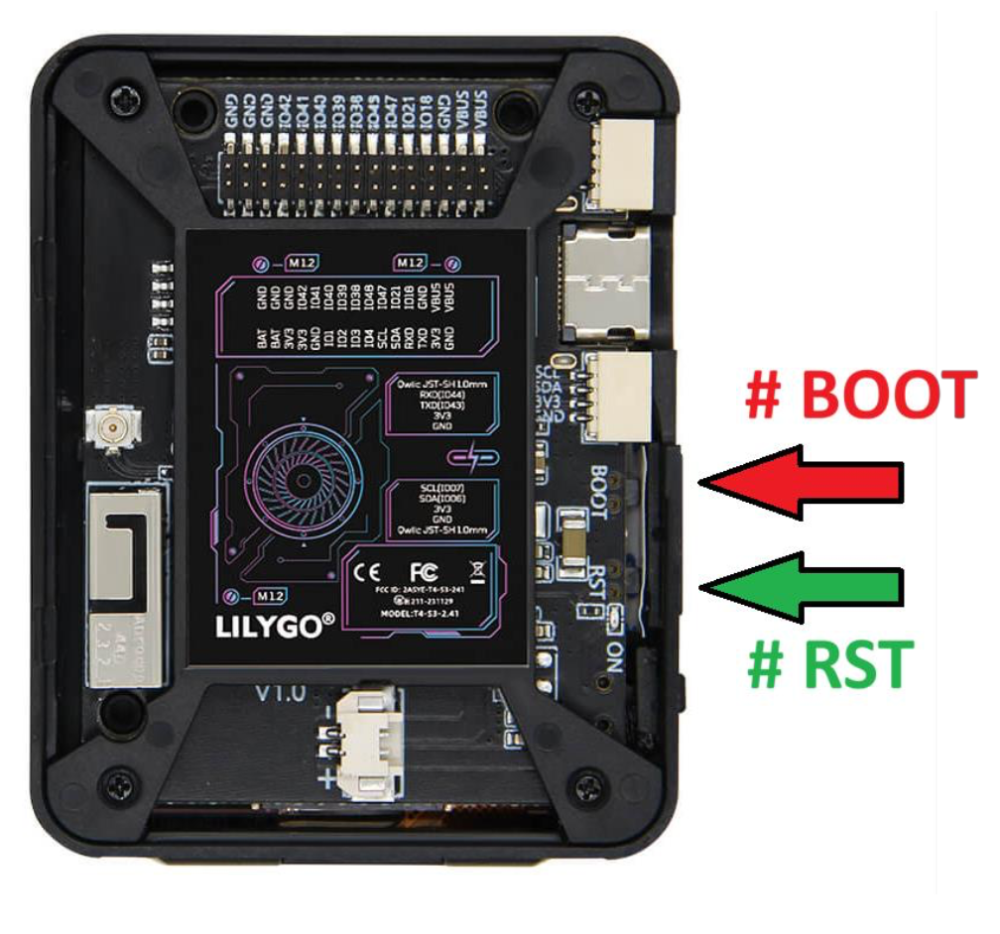

# ESP32-T4-S3 LilyGO

## Introduction

This project is a weather station system built using an **ESP32-T4-S3 LilyGO**, a
**touchscreen display**, and data fetched from the **SMHI weather
API**.
The purpose of the system is to give users an easy and interactive way
to view local weather information in real time. It solves the problem of
needing a simple, dedicated interface that gathers and presents weather
data without relying on a computer or smartphone.

The system is developed using **PlatformIO**, and the main functionality
includes: - Fetching and parsing weather data from SMHI
- Displaying temperature, precipitation, and forecast information
- Allowing user interaction via touchscreen menus
- Showing updated information at regular intervals

------------------------------------------------------------------------

## Getting started

This section explains how to set up the project on a new development
machine and prepare the ESP32.

### Prerequisites

Before you begin, make sure you have:

-   **Visual Studio Code** installed
-   **Python** installed on the computer
-   **PlatformIO extension** installed in VS Code
-   An **ESP32-T4-S3 LilyGO**
-   USB cable for flashing the microcontroller
-   Internet connection (required for fetching SMHI data)

### Installation

1. Clone the project:
   git clone https://github.com/PA1484-Group-8/Weather-app

2. Install Visual Studio Code:
   https://code.visualstudio.com/

3. Install Python:
   https://www.python.org/

4. Open Visual Studio Code and install the **PlatformIO** extension from the Extensions view.

5. Open the project folder in **Visual Studio Code**.

6. Wait for PlatformIO to automatically detect the project and install all required dependencies.

7. Connect your ESP32 to the computer via USB.

------------------------------------------------------------------------

## Building and running

Follow these instructions to build and run the system on the ESP32.

### Prepare the device

Set device in download mode:
1. Press BOOT + RST
2. Release RST
3. Release BOOT

You **NEED** to do this every time before you press **UPLOAD**

### Building and Uploading

1. In Visual Studio Code, go to **File → Open Folder** and select the **Weather-app** project directory.

2. Wait for all third-party dependency libraries to finish installing.

3. Click the **✓** icon in the lower-left corner (or **Build** in the PlatformIO sidebar) to compile the project.

4. Connect the board to the computer via USB.

5. Prepare the device for flashing  
   ([see instructions](#prepare-the-device)).

6. Click the **→** icon (or **Upload** in the PlatformIO sidebar) to flash the firmware to the ESP32.

7. Restart the device after the upload is complete.

### Startup procedure

-   Once powered on, the ESP32 connects to WiFi.
-   The system requests current weather and forecast data from the SMHI
    API.
-   The touchscreen interface initializes and shows the main menu or
    dashboard.

### Program operation

- The system includes different screens such as:
    - Current weather
    - Hourly or daily forecast
    - System settings
- Users navigate the interface by swiping between the different tiles/screens, and the settings screen uses dropdown menus.
- The device fetches new data at regular intervals or when manually refreshed.

------------------------------------------------------------------------

## Features

Below is a checklist of which **User Stories** have been implemented in
this project.
Adjust this list to match your actual progress.

### Start-up
- [x] US1.1C: As a user, I want to see a starting screen to display the current program version and group number.
- [x] US1.3: As a user, I want to have a screen to view weather forecast data.
- [x] US1.2C: As a user, I want to see the weather forecast for the next 7 days for the selected city at 12:00 with symbols (clear sky, rain, snow, thunder).

### Tile Navigation & Access
- [x] US2.1: As a user, I want to navigate between different screens by sliding a finger over the touch screen.

### Weather Data Display
- [x] US3.1: As a user, I want to have a screen to view historical weather data.
- [x] US3.2D: As a user, I want to view the latest months of historical hourly data using a slider, where empty = oldest datapoint and full = newest.

### Settings & Configuration
- [x] US4.1: As a user, on the fourth screen, I want a single settings screen to configure both the city and weather parameter options.
- [x] US4.2B: As a user, I want to select from four weather parameters (temperature, humidity, wind speed, air pressure) using a dropdown.
- [x] US4.3B: As a user, I want to select from five cities (Karlskrona, Stockholm, Göteborg, Malmö, Kiruna) using a dropdown.
- [ ] US4.4: As a user, I want to reset the selected city and weather parameter to default using a button.
- [x] US4.5: As a user, I want to set my default city and weather parameter so they auto-select at startup.
- [x] US4.6: As a user, I want the device to store my default city and weather parameter even after restart.

### Extended Forecast & Visualization
- [ ] US5.1: As a user, I want to access a screen to view the weather forecast for all of Sweden.
- [ ] US5.2: As a user, I want to see the temperature forecast for each administrative area of Sweden (“Landskap”) on a map, with:
    - A color-coded temperature zone per administrative area, using the center of each area to access the forecast.
    - A looped animation displaying the hourly forecast for the next 24 hours.

